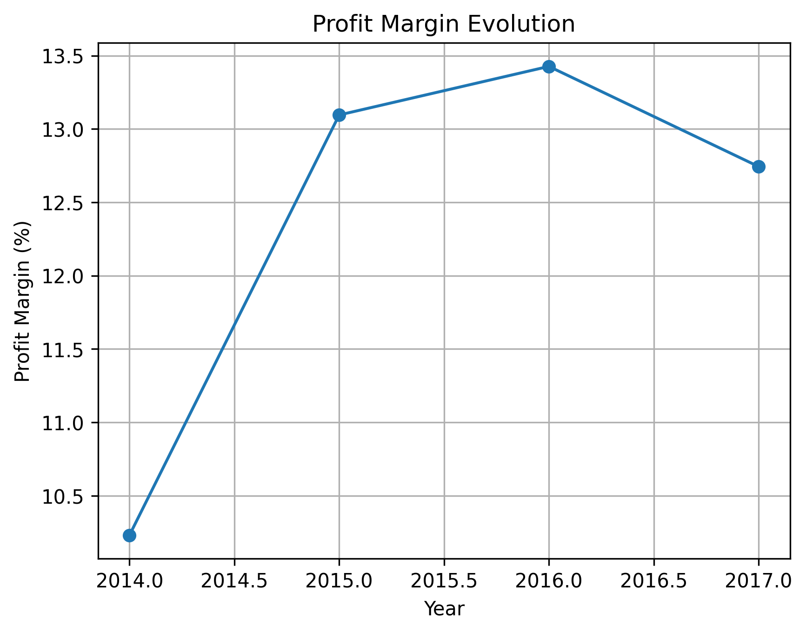
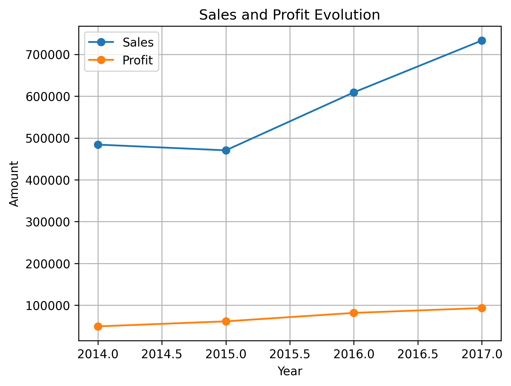
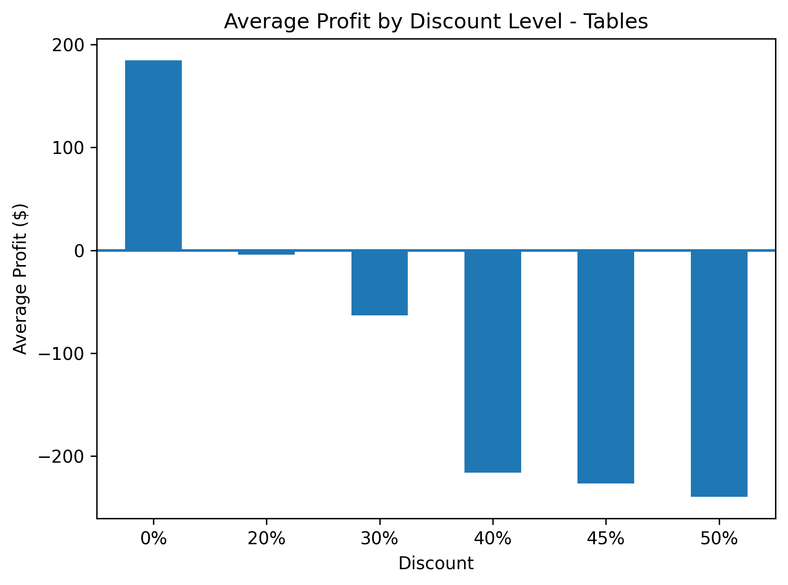
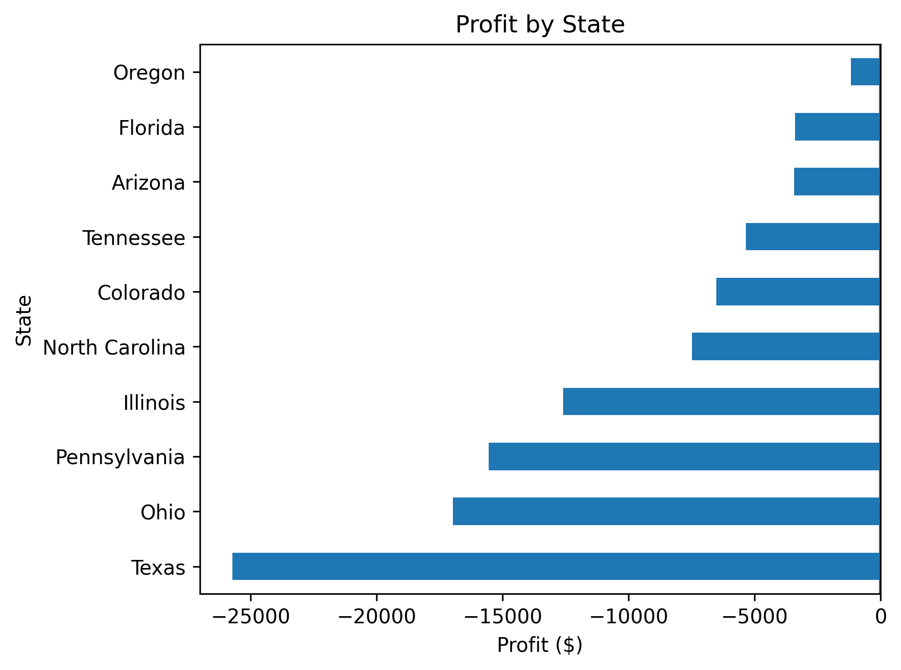
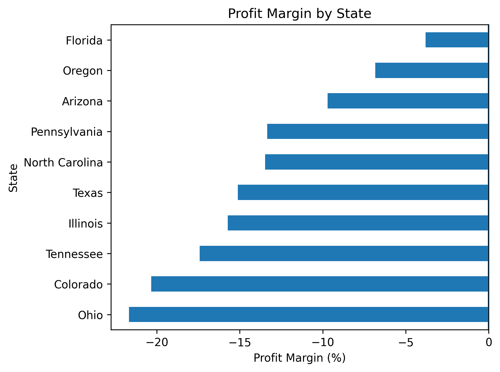
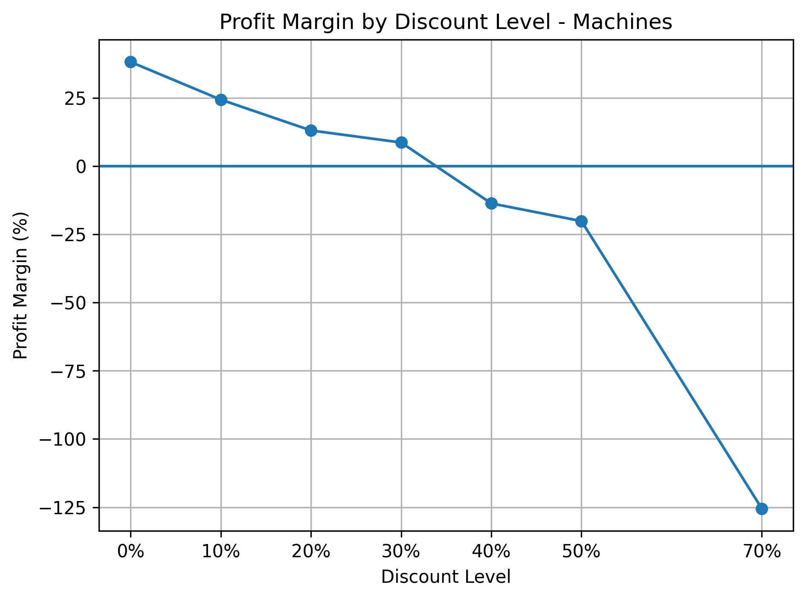

# 📊 Superstore Sales & Profitability Analysis

Exploratory Data Analysis project using Python to investigate sales performance, profitability, geographical differences and the potential impact of discount strategies.

---

## 📌 Project Overview

This project analyzes the **Superstore dataset**, containing 9,994 sales records across different product categories, sub-categories, customers and geographical locations.

The main objective is not only to describe sales performance, but to identify **where profitability problems occur**, investigate the factors associated with those losses and translate the findings into actionable business insights.

The analysis follows a drill-down approach, moving from overall company performance to specific categories, states, products and discount levels.

## 🛠️ Tools & Technologies

- **Python** — Data analysis
- **Pandas** — Data manipulation, filtering, grouping and aggregation
- **Matplotlib** — Data visualization
- **VS Code** — Development environment

## 🎯 Business Questions

This analysis aims to answer the following questions:

- How profitable is the business overall?
- Which categories and sub-categories generate the highest and lowest profitability?
- How have sales, profit and profit margin evolved over time?
- Which states generate the largest losses?
- Are the states with the largest absolute losses also the least profitable relatively?
- What factors are associated with the poor performance of specific products and regions?
- How are discount levels associated with profitability?

## 🔍 Analysis

### 1. Overall Business Performance
| Metric | Result |
|---|---:|
| 💰 Total Sales | **$2.30M** |
| 📈 Total Profit | **$286.40K** |
| 📊 Profit Margin | **12.47%** |

The company shows solid overall performance, generating approximately **$2.3 million in sales** and **$286K in profit**, with an overall profit margin of **12.47%**.

Although the company is profitable overall, this high-level view does not reveal how profitability is distributed across different product categories, sub-categories and geographical regions.
### 2. Category & Sub-Category Profitability
| Category | Sales | Profit | Profit Margin |
|---|---:|---:|---:|
| Technology | $836.15K | $145.45K | **17.40%** |
| Office Supplies | $719.05K | $122.49K | **17.04%** |
| Furniture | $742.00K | $18.45K | **2.49%** |

All three categories are profitable. However, while **Technology** and **Office Supplies** achieve profit margins of approximately **17%**, Furniture has a significantly lower margin of only **2.49%**.

This substantial difference suggests that there may be underperforming products or sub-categories within Furniture that require further investigation.
#### Furniture Deep-Dive

Further analysis at the sub-category level revealed several loss-making areas. Within **Furniture**, both **Tables** and **Bookcases** generate losses.

- **Tables:** -8.56% profit margin
- **Bookcases:** -3.02% profit margin

Tables stands out as the main concern, showing the lowest profit margin within Furniture and the lowest profit margin across all sub-categories in the dataset.

This finding motivated a deeper investigation into **Tables** to understand which factors are associated with its poor profitability.
### 3. Sales & Profitability Over Time

Sales decreased slightly between **2014 and 2015**, before growing substantially throughout 2016 and 2017. Profit followed a positive trend, increasing every year and reaching approximately **$93.4K in 2017**.

Although **2017 achieved the highest sales and profit**, its profit margin decreased from **13.43% in 2016 to 12.74% in 2017**.

This indicates that the strong growth in sales did not translate into a proportional improvement in profitability.

### 4. Tables Deep-Dive

After identifying **Tables** as the worst-performing sub-category, with an overall profit margin of **-8.56%**, the analysis was extended to investigate potential factors associated with these losses.

Discount levels emerged as an important factor to investigate. Orders without discounts generated an average profit of approximately **$116**, while profitability progressively deteriorated at higher discount levels.

- **0% discount:** +$116 average profit
- **20% discount:** approximately break-even
- **30% discount:** -$85 average profit
- **40% discount:** -$226 average profit
- **45% discount:** -$307 average profit
- **50% discount:** -$210 average profit

The results show a clear **association between higher discount levels and lower profitability**, particularly from discount levels of 30% and above.

However, this relationship should not be interpreted as causation. The dataset does not provide information about the business reasons behind these discounts, such as stock clearance, promotional campaigns or product-specific pricing strategies.

### 5. Geographical Analysis

Profitability varies significantly across states. To identify the most problematic regions, the analysis considered both **absolute profit/loss** and **profit margin**.

**Texas** generated the largest absolute loss, with approximately **-$25.7K in profit**. However, **Ohio** showed the lowest profit margin at **-21.69%**, while also generating the second-largest absolute loss at approximately **-$17.0K**.

This distinction is important because absolute losses and relative profitability provide different perspectives. A state may generate a large loss because of its sales volume, while profit margin indicates how efficiently those sales translate into profit.

Because Ohio performed poorly on **both metrics**, it was selected for further investigation.

### 6. Ohio Deep-Dive

Because Ohio performed poorly in both absolute and relative profitability, a drill-down analysis was conducted to identify the main sources of its losses.

At the category level, **Technology** was the worst-performing category, generating approximately **-$12.65K in profit** with a profit margin of **-35.46%**.

Further analysis revealed that **Machines** was the main driver of these losses:

- **Sales:** $8.98K
- **Profit:** -$11.77K
- **Profit Margin:** -131.11%
- **Unique Orders:** 8

All eight Machine orders in Ohio were associated with a **70% discount**.

At the product level, the **Cubify CubeX 3D Printer Double Head Print** generated approximately **-$9.24K in profit**, accounting for around **78.5% of the total Machines losses in Ohio**.

These findings suggested that the unusually high discount level could be an important factor associated with the poor profitability of Machines. However, the small number of orders and the lack of information about the reasons behind the discounts prevent establishing a causal relationship.
### 7. Machines Discount Analysis

The unusually high discount observed in Ohio raised an important question: **was this an isolated regional issue, or part of a broader pattern affecting Machines?**

To investigate this, Machine sales were analyzed across the entire dataset by discount level.

| Discount | Profit | Avg. Profit | Profit Margin | Records |
|---:|---:|---:|---:|---:|
| 0% | $27.14K | $935.79 | **38.20%** | 29 |
| 10% | $832 | $416.04 | **24.39%** | 2 |
| 20% | $4.97K | $160.33 | **13.10%** | 31 |
| 30% | $326 | $65.21 | **8.68%** | 5 |
| 40% | -$2.67K | -$205.14 | **-13.64%** | 13 |
| 50% | -$7.64K | -$636.27 | **-20.13%** | 12 |
| 70% | -$19.58K | -$851.27 | **-125.50%** | 23 |

Profitability shows a clear downward pattern as discount levels increase. Machine sales remained profitable at discount levels up to 30%, while the observed transactions with discounts of **40% or higher generated negative profit**.

The most severe results occurred at the **70% discount level**, where 23 records generated approximately **-$19.58K in total profit** and a profit margin of **-125.50%**.

This broader pattern strengthens the evidence of an association between high discount levels and poor Machine profitability. However, it does not establish that discounts directly caused the losses.

## 💡 Key Findings

1. **The company is profitable overall**, generating approximately **$2.3M in sales**, **$286K in profit**, and an overall profit margin of **12.47%**.

2. **Profitability varies significantly across product categories.** Technology and Office Supplies achieve profit margins of approximately **17%**, while Furniture reaches only **2.49%**.

3. **Tables is the worst-performing sub-category**, with a profit margin of **-8.56%**. Higher discount levels are associated with increasingly negative average profits, making discount strategy an important area for further investigation.

4. **Strong sales growth does not necessarily translate into higher relative profitability.** Although 2017 achieved the highest sales and absolute profit, profit margin decreased from **13.43% in 2016 to 12.74% in 2017**.

5. **Geographical performance differs substantially.** Texas generated the largest absolute loss, while Ohio combined the **lowest profit margin (-21.69%)** with the second-largest absolute loss, making it a particularly relevant state for further analysis.

6. **Machines is the main driver of Technology losses in Ohio.** The sub-category generated approximately **-$11.77K in profit** with a **-131.11% profit margin**, and all eight Machine orders in Ohio were associated with a **70% discount**.

7. **The discount pattern observed in Ohio also appears at a broader level.** Across all Machine sales, profitability progressively declined as discounts increased. Transactions with discounts of **40% or higher were unprofitable in the analyzed data**, with the 70% discount level reaching a profit margin of approximately **-125.50%**.

## 🎯 Business Recommendations

Based on the findings of this analysis, the following actions could be considered:

1. **Review the current discount strategy.** Investigate why high discounts are being applied, particularly to Tables and Machines, before making major pricing decisions.

2. **Evaluate profitability before approving high discounts.** The company could assess the expected profit margin of transactions before applying significant discounts and consider establishing minimum profitability thresholds or additional approval requirements.

3. **Review consistently loss-making products.** Products generating significant losses should be evaluated to determine whether they are still worth selling under the current pricing and discount strategy. Before discontinuing any product, additional factors such as costs, sales volume and strategic importance should be considered.

## ⚠️ Limitations

This analysis provides useful insights into sales and profitability, but several limitations should be considered:

- **Lack of cost details:** The dataset provides Sales and Profit, but does not include detailed information about product costs, shipping costs or other operational expenses.

- **Unknown reasons behind discounts:** The dataset shows the discount applied to each transaction, but does not explain why the discount was offered. Discounts could be related to promotions, stock clearance, customer agreements or other business decisions.

- **Correlation does not imply causation:** Higher discount levels are strongly associated with lower profitability in several areas of the analysis, but the available data is not sufficient to conclude that discounts directly caused the losses.

- **Small sample sizes in specific analyses:** Some drill-down findings are based on a limited number of observations. For example, the Machines analysis in Ohio contains only eight unique orders.

- **Limited time period:** The dataset covers sales from 2014 to 2017, so the findings only represent the business performance during this period.

## 🚀 Future Improvements

Several improvements could extend this analysis:

- Incorporate detailed **product cost data** to better understand the drivers behind negative profitability.
- Analyze the **business reasons behind discount decisions**, including promotions, inventory clearance and customer-specific agreements.
- Perform a deeper analysis of **customer segments** to determine whether profitability and discount patterns differ between customer types.
- Extend the temporal analysis to include **monthly and seasonal trends**.
- Build an interactive **Power BI dashboard** to allow stakeholders to explore sales, profitability, geographical performance and discount levels dynamically.